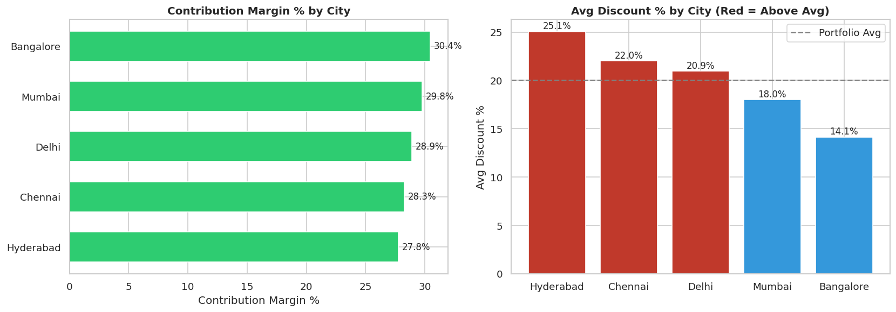
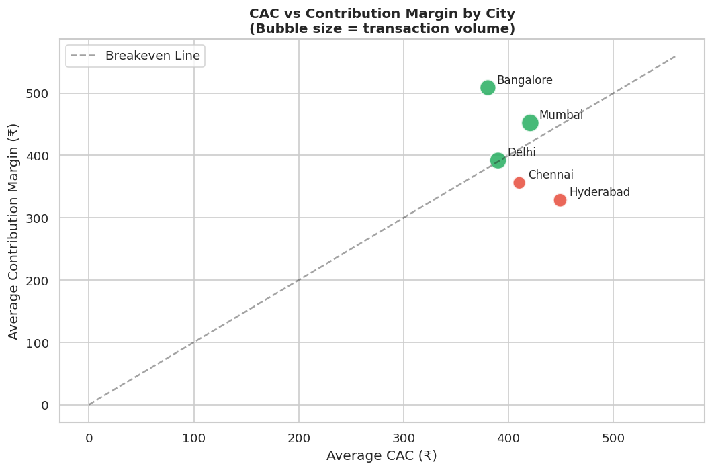
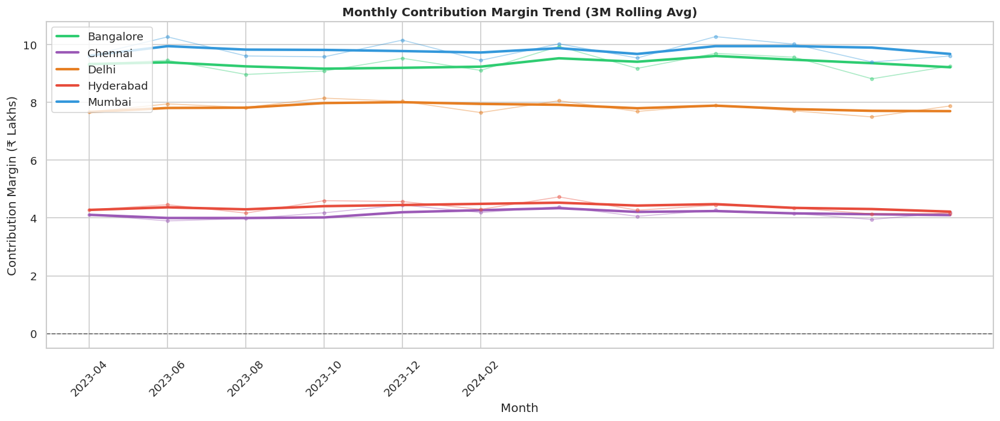
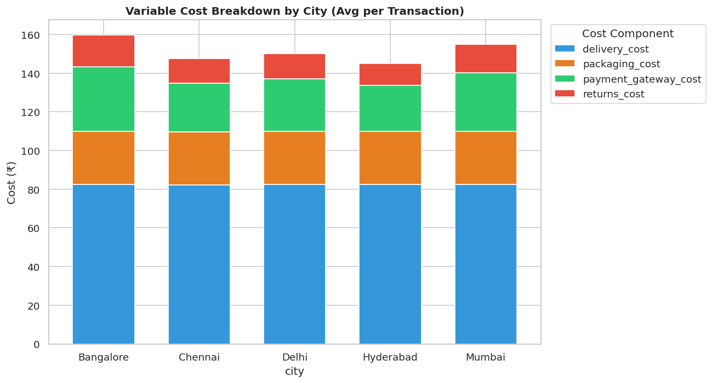
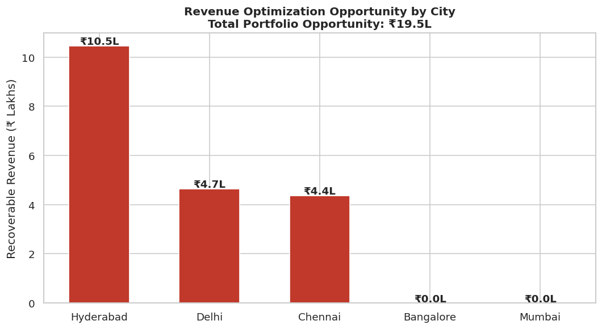

# Multicity Unit Economics & Margin Optimization

## Problem

Diagnosed declining profitability across 100k+ transactions in a 5-city marketplace operating below contribution margin breakeven.

## Approach

* Built SQL-based revenue and cost models
* Calculated AOV and CAC
* Performed city-level variance analysis
* Automated reporting using Python and Excel

## Key Insights

* Identified 12% discount leakage
* Contribution margin improved by 14%
* Variable costs reduced by 9%

## Business Impact

* Identified ₹22L annual revenue optimization opportunity

## Tools

SQL, Python (Pandas, Matplotlib), Excel

---

## Visualizations

### Contribution Margin & Discount Analysis

### CAC vs Contribution Margin

### Monthly Contribution Margin Trend

### Variable Cost Breakdown

### Revenue Opportunity

